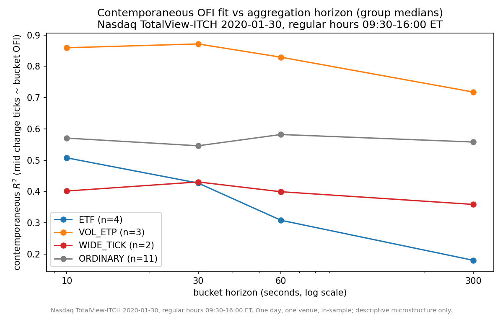
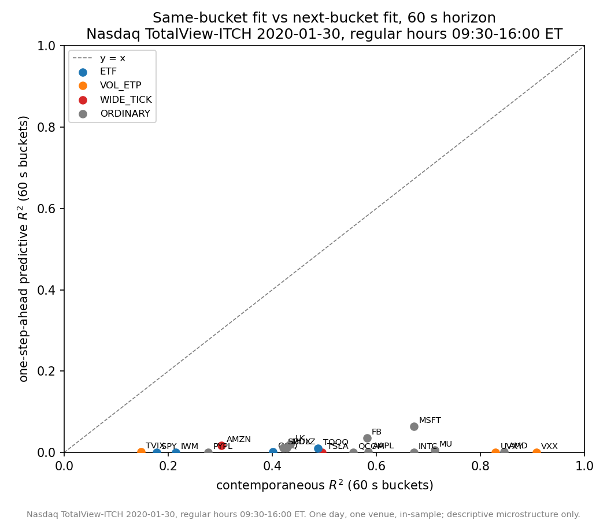
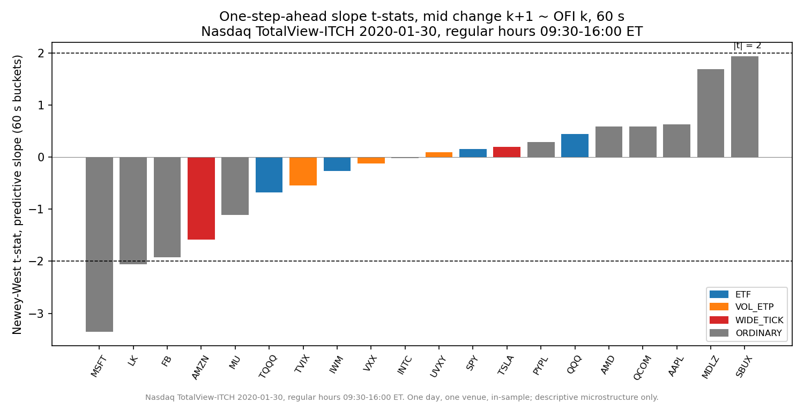

# Week 9 — Order flow imbalance and price impact: the study

The capstone analysis: does the relationship between order-flow
imbalance and price movement documented by Cont, Kukanov & Stoikov
(2014) reproduce on a single day of Nasdaq TotalView-ITCH data, rebuilt
from the raw feed by this project's own C++ engine?

Scope stated up front: **one day (2020-01-30), one venue, in-sample,
descriptive microstructure — not a trading signal.** Every table,
figure, and parquet in this study carries that caveat (parquets embed it
as schema metadata).

## Result 1 — Price impact scales inversely with depth

Per symbol, the 10-second contemporaneous impact coefficient β
(mid-price change in ticks per share of best-level OFI) against
time-weighted touch depth, cross-sectionally, log-log:

> **slope = −1.26 [95% CI −1.54, −0.98], R² = 0.83** (all 20 symbols)
> slope = −1.23 [−1.54, −0.92], R² = 0.84 (excluding index ETFs)

The law is not a 10-second artifact — the same fit at longer horizons:

| horizon | slope | 95% CI | R² |
|---|---|---|---|
| 10 s | −1.26 | [−1.54, −0.98] | 0.83 |
| 30 s | −1.25 | [−1.55, −0.95] | 0.81 |
| 60 s | −1.22 | [−1.56, −0.89] | 0.77 |

Nor does any single symbol carry it: leave-one-out across all 20
deletions keeps the slope in [−1.47 (dropping VXX), −1.09 (dropping
AMZN)] — AMZN and TSLA are the highest-leverage points, and the fit
survives losing either.

CKS's reference value of −1 sits inside the confidence interval in both
specifications. Doubling visible depth roughly halves price impact —
reproduced from scratch, feed bytes to regression, in one repo.
The deviations are informative, not noise:

- **AMZN, TSLA sit ~3–5× above the line** — multi-dollar spreads mean
  10s mid changes come from quote repositioning across ticks, not
  depletion of the thin visible touch.
- **SPY, IWM sit below** — Nasdaq-only touch depth understates their
  consolidated cross-venue liquidity, so measured β is small relative
  to *visible* depth.

Figure: `analytics/figures/impact_vs_depth.png`.

## Result 2 — Contemporaneous fit is strong; prediction is not

Multi-horizon regressions (10s/30s/60s/300s), contemporaneous vs
strictly one-step-ahead (bucket k OFI vs bucket k+1 mid change, zero
overlap):

| | median R² (20 symbols) |
|---|---|
| contemporaneous, any horizon | **0.48–0.53** |
| one-step-ahead, any horizon | **≤ 0.012** |

At 60s, 17 of 20 symbols show no significant predictive slope
(Newey–West |t| < 2), and the three that "clear the bar" (MSFT −3.36,
LK −2.06, FB −1.92) are *negative*. With 20 symbols × 4 horizons = 80
predictive tests, roughly 4 hits are expected at the 5% level by chance
alone — three marginal negatives are statistically indistinguishable
from that, so the honest reading is no reliable predictability rather
than "reversal detected". Same-bucket explanatory power near
0.5 coexisting with next-bucket power near zero is the honest headline:
best-level OFI describes price formation; it does not forecast it at
these horizons on this day.

The CKS aggregation effect (R² strengthening with bucket size) shows up
as instrument-dependent, not universal: single names and vol ETPs
plateau or improve toward 300s (VXX 0.86→0.91), while index ETFs decay
sharply (SPY 0.33→0.13) — consistent with their mids being driven by
cross-venue flow a single venue's L1 cannot see.

## Verification

Development was AI-assisted (Claude Code); verification is what makes
the numbers trustworthy regardless of who or what wrote the first pass.
An adversarial review pass reproduced, from the raw subset parquets with
independent code: AAPL's 60s contemporaneous beta/R² and NW t
(match to machine precision), AAPL's 60s predictive R² (exact), MSFT's
10s beta and its position in the log-log plot (exact), and the
depth-halving convention. One convention inconsistency it caught
(bucket-0 baseline mid taken from pre-open in `impact_depth.py`) was
fixed; both studies now share the identical bucket convention and their
overlapping betas agree to machine precision. The headline slope moved
by less than 0.001 under the fix. The recomputation lives in the repo as
[analytics/verification/verify_headlines.py](../analytics/verification/verify_headlines.py)
— a clean-room reimplementation that checks six headline numbers and
exits nonzero on any mismatch.

## Files

- `analytics/studies/ofi_horizons.py` → `output/ofi_regressions.parquet` (160 regressions), figures below
- `analytics/studies/impact_depth.py` → `output/impact_depth.parquet`, figure `impact_vs_depth.png`
- `analytics/verification/verify_headlines.py` — clean-room recomputation of every headline number in this document (independent implementation; run it yourself)
- [analytics/results.ipynb](../analytics/results.ipynb) — browsable results: loads the committed parquets, renders the tables and the money plot with no build required

## References

- Cont, R., Kukanov, A., & Stoikov, S. (2014). The price impact of order book events. *Journal of Financial Econometrics*, 12(1), 47–88.
- Bouchaud, J.-P., Farmer, J. D., & Lillo, F. (2009). How markets slowly digest changes in supply and demand. In *Handbook of Financial Markets: Dynamics and Evolution*, 57–160. Elsevier.
- Hasbrouck, J. (2007). *Empirical Market Microstructure*. Oxford University Press.
- O'Hara, M. (2015). High frequency market microstructure. *Journal of Financial Economics*, 116(2), 257–270.

Design deviations from CKS (2014): single venue rather than consolidated
feed, one trading day rather than a month panel, best-level OFI only,
and clock-time buckets — each noted where it bites above.
