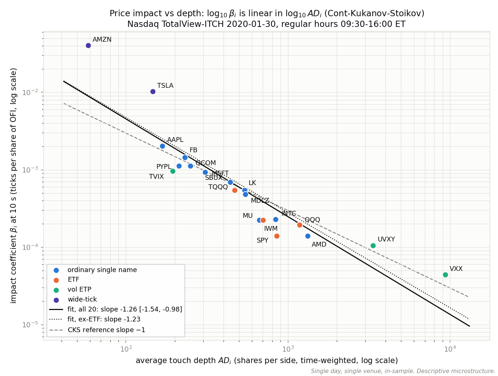

# Full-Depth: rebuilding Nasdaq's limit order book from raw feed bytes

## One day, one laptop

On Thursday, January 30, 2020, Nasdaq's TotalView-ITCH 5.0 feed carried 423,285,709 messages — 12.95 GB of big-endian binary once decompressed. Nasdaq publishes that day as a free sample file. I took it and, across ten project milestones built in evenings over three weeks (July–August 2026) on a single laptop, built everything between the raw bytes and a finished statistical study: a framing scanner, a full decoder for all 23 message types, a whole-market order book engine covering 8,915 symbols, a benchmark harness, a binary export layer with a frozen C++/Python contract, and a set of microstructure analyses that ends with a replication of a published price-impact law. The engine replays the entire day at 7.4 million messages per second, single-threaded, with zero order-book invariant violations and all 8,915 end-of-day audits passing.

## Why this project

Trading-technology firms care about a specific cluster of skills: feed handlers that parse binary exchange protocols correctly, order book engines that stay consistent under hundreds of millions of updates, correctness you can prove rather than assert, and performance numbers that survive scrutiny. This project is my attempt to demonstrate all four on real data at real scale, with the methodology written down. The scope is deliberately narrow: market-data engineering and descriptive microstructure only. No price prediction, no backtesting.

## The build, stage by stage

### Framing scan

ITCH frames every message with a 2-byte length prefix, so the first milestone was a scanner that walks the framing without decoding a single field. The hard problem is proving you parsed the framing right when there is no ground truth: the answer is byte accounting — every byte in the file must be attributed to exactly one message or prefix, with nothing left over. The scan accounted for all 12,952,050,754 bytes exactly, counted 423,285,709 messages, and ran at 18.6M messages per second on the first full pass (mmap cold, I/O included).

### Decoder

Week 2 was a decoder for every field of all 23 message types, hand-built from the spec PDF into a field-offset table, with fixtures cross-checked against the real file. The hard problem is validating a decoder against data nobody labelled for you. My main tool was internal consistency: every message carries a per-day stock locate code, so I cross-checked 192.7M locate-to-symbol mappings against the directory messages — 0 mismatches — plus 0 timestamp-ordering or side-field violations. Full decode ran at 17.2M messages per second.

### Book engine

Weeks 3–4 built the order book itself. The hard problem is that ITCH's modify messages (execute, cancel, delete, replace) never repeat the symbol or side — the engine must resolve every one through the order reference number, and a replace must carry side and symbol over from the original order. The engine replayed the whole market — 186.6M add orders, a peak of 1.93M simultaneously live orders across 8,915 symbols — with 0 invariant violations, all 8,915 end-of-day audits passing, and the book fully empty at end of session. Getting to zero violations required fixing my invariant, not my engine; that story is below.

### Benchmarks and optimization

Week 5 was a harness before any tuning: full-day input, I/O included, every run reported plus the median, single-threaded, machine spec stated (Apple M4, 16 GB RAM, Apple clang 17, `-O2`). Baseline medians:

| Stage | msgs/s | GB/s |
|---|---|---|
| framing scan | 20.2M | 0.62 |
| full decode | 17.5M | 0.54 |
| whole-market book build | 3.0M | 0.09 |

Scan and decode sit at the machine's effective single-thread mmap throughput — they are I/O-bound. The book stage runs at 0.09 GB/s, far below that floor, so the cost is the data structures. Profiling confirmed it: map operations were roughly 47% of samples, hashing plus allocation another 15%.

Week 6 attacked the containers behind an unchanged interface, keeping only changes that passed the full correctness gate (57 unit tests, zero violations, 8,915/8,915 audits):

| Change | msgs/s | Verdict |
|---|---|---|
| baseline: `std::map` ladders + `std::unordered_map` store | 3.0M | before picture |
| sorted-vector ladders + open-addressing order store (backshift deletion) | 6.3M | kept — 2.1× |
| ladder orientation flips (asks descending; both descending) | 3.7M / 2.5M | reverted — slower |
| O(1) fast path for back-of-ladder hits | ~6.7M | kept, no measurable gain |
| structure-of-arrays ladders | 6.6M | kept, no measurable gain |
| one-frame lookahead + order-store slot prefetch | 6.9M | kept, marginal |
| final | 7.4M median | 2.5× total |

The failed rows are the interesting ones. The orientation flips lost because churn is asymmetric per side — bid churn skews toward the touch, ask churn runs deep — which I would not have guessed without measuring. And three independent structural rewrites of the ladders all landing in the same 6.6–6.9M band is a diagnostic in itself (see below). One trap worth recording: a replay once measured 0.4M msgs/s — 16× slow — because macOS had demoted the process to background I/O priority. All reported runs are foreground.

### Export layer

Week 7 froze a binary contract between the C++ writer and the Python reader: a 24-byte trade record and a 32-byte L1 record, with the layout enforced by `static_assert` on one side and import-time asserts on the other. The hard problem is the edge cases a naive exporter silently mangles: non-printable executions that never hit the tape but still shrink the book, 12,060 administrative cross messages with zero shares, and 215 L1 rows where bid ≥ ask during auction-pending windows — legitimate, not bugs. The full day produced 10,344,031 trade records and 208,792,496 L1 records (6.9 GB), passing 19/19 Python-side integrity checks, then compressed to Parquet via zstd (2.8 GB L1, 89 MB trades) in 64 seconds.

### Analytics

Weeks 8–9 moved to Python over top-20 symbol subsets, duration-weighted throughout because a change-only L1 stream makes row-count averages meaningless. Week 8 ran three studies: order flow imbalance (contemporaneous 1-minute OFI vs mid-change R² spanning 0.14–0.91 across symbols, splitting cleanly by instrument type), quoted liquidity (SPY at 0.46 bps time-weighted spread with $553k at the touch; TSLA at 5.84 bps), and order activity — market-wide, a median of 19.4 cancels-plus-deletes per execution, and closing crosses printing up to about 31% of some names' daily Nasdaq executions. Every headline number was independently recomputed by an adversarial reviewer; AAPL's time-weighted spread matched to full float precision. Week 9 was the capstone study, described in the discoveries below.

### External validation

The final check reaches outside the repo entirely: for every Nasdaq-listed symbol in the top-20 subsets, the engine's 16:00:00 closing-cross print was reconciled against the official close from Yahoo Finance. All 15 symbols with available data match to the cent (the check has to undo Yahoo's retroactive split adjustment — AAPL ×4, AMZN ×20, TSLA ×15 — which is itself a nice trap). The four NYSE Arca-listed ETFs correctly have no Nasdaq closing cross at all. Feed bytes to official closing prices, one unbroken chain.

## Three things worth telling

### The invariant that fired 458 times — and was wrong every time

My first book invariant was the obvious one: a displayed book never crosses while its symbol is in trading state. It fired 458 times on this day. Every single event traced to just 4 symbols: ANPC and BDTX, which IPO'd that very day, and RKDA and DTSS, which reopened from volatility halts — DTSS stayed crossed for 5.4 minutes through repeated LULD collar extensions. The lesson from the spec and the tape together: between a transition into trading state and that symbol's next cross print, a crossed displayed book is legitimate — the auction hasn't cleared the crossed interest yet. The fix was an auction-aware invariant, and with it the violation count on 423M messages is exactly zero. A correctness check that never accounts for market mechanics isn't a correctness check.

### The wall at 7.4 million messages per second

I targeted 10M msgs/s for the book build and stalled at 7.4M. The diagnosis was more valuable than the number: at 7.4M the engine spends about 135 ns per message, and the order store is roughly 84 MB of randomly probed table — far beyond any cache level — so nearly every book message pays about one DRAM round-trip. The tell was that three independent structural rewrites of the price ladders all landed inside the same 6.6–6.9M band: when unrelated redesigns converge on one ceiling, the bottleneck isn't the thing you're redesigning. The engine is memory-latency bound on the order store, which is why the next lever is hiding latency, not restructuring ladders.

### A published law reproduced — and an honest negative result

The week-9 study asks whether the Cont–Kukanov–Stoikov (2014) relationship between order-flow imbalance and price impact reproduces on this day, rebuilt from feed bytes by my own engine. It does: regressing each symbol's 10-second impact coefficient against its time-weighted touch depth, cross-sectionally in log-log, gives a slope of −1.26 with 95% CI [−1.54, −0.98] and R² 0.83 across 20 symbols — CKS's reference value of −1 sits inside the interval (−1.23 [−1.54, −0.92] excluding index ETFs). Doubling visible depth roughly halves impact. The counterpart result matters just as much: contemporaneous regressions explain a lot (median R² 0.48–0.53 across horizons) while strictly one-step-ahead versions collapse to R² ≤ 0.012, with 17 of 20 symbols showing no significant predictive slope at 60 seconds — and the three that clear the bar are negative. Best-level OFI describes price formation on this day; it does not forecast it.



An adversarial reviewer reproduced the headline regressions from the raw parquets with independent code, caught one bucket-convention inconsistency, and the fixed slope moved by less than 0.001.

## What I'd do next

- An N-message prefetch pipeline for the order store — a lookahead queue rather than one frame — guided by counter-level cache-miss profiling, to attack the DRAM-latency wall directly.
- More trading days, so the analytics stop being one-day, in-sample descriptions and the cross-sectional results get out-of-day checks.
- Multi-level OFI: the best-level version visibly underexplains wide-tick names like AMZN, where mids move by repricing inside the spread.
- Cross-venue depth for the index ETFs — SPY and IWM sit below the impact-depth line precisely because Nasdaq-only depth understates their consolidated liquidity.

## How it was built, honestly

Development was AI-assisted: I directed Claude Code through the plan,
reviews, and iterations, and the repo is engineered so that trust never
rests on authorship. Every headline number is reproduced by a committed
clean-room verification script (`analytics/verification/verify_headlines.py`),
the benchmark methodology is written down before the numbers, the unit
tests were written from the spec rather than the implementation, and the
final anchor is external: 15/15 Nasdaq-listed closing-cross prints match
official closing prices to the cent. Check the claims, not the author.

## References

- Cont, R., Kukanov, A., & Stoikov, S. (2014). The price impact of order book events. *Journal of Financial Econometrics*, 12(1), 47–88.
- Bouchaud, J.-P., Farmer, J. D., & Lillo, F. (2009). How markets slowly digest changes in supply and demand. In *Handbook of Financial Markets: Dynamics and Evolution*. Elsevier.
- Nasdaq TotalView-ITCH 5.0 specification, nasdaqtrader.com.

## Build it yourself

Repo: <https://github.com/alexislowys/full-depth>. Requires CMake ≥ 3.24 and a C++20 compiler; tested with Apple clang 17 on macOS (arm64).

```
cmake -B build -DCMAKE_BUILD_TYPE=Release
cmake --build build -j
ctest --test-dir build
```

Data: free full-day TotalView-ITCH 5.0 sample files from Nasdaq's public server at <https://emi.nasdaq.com/ITCH/> (this day: `01302020.NASDAQ_ITCH50.gz`, ~5.6 GB compressed, ~13 GB raw; not committed). Provenance details in `docs/data.md`.
